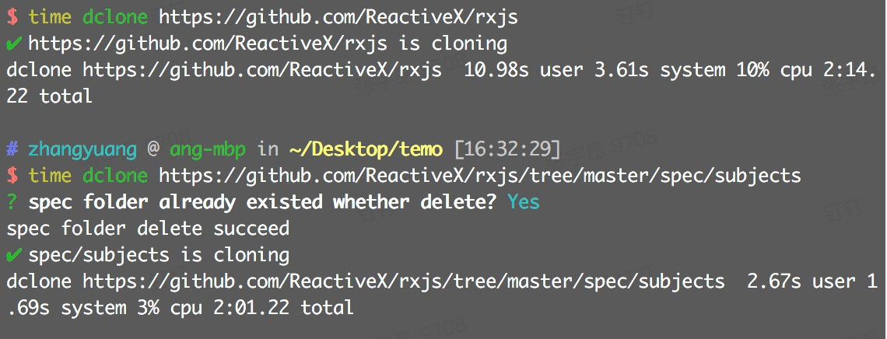

English | [简体中文](./README_zh-CN.md)

# Download specified directory in github/gitlab

<a href="https://circleci.com/gh/ykfe"></a>
<a href="https://codecov.io/gh/ykfe/dclone"></a>
<a href="https://npmcharts.com/compare/dclone"></a>
<a href="https://standardjs.com"></a>
<a href="https://github.com/facebook/jest"></a>
<a href="https://github.com/ykfe/egg-react-ssr"></a>


dclone is the simplest command for downloading specified directory or whole repo in github/gitlab (used depend on git), dclone can completely replace `git clone` and cut down download time

## Features

Let me introduce some awesome features in dclone

- quickly: you can only download single folder and cut down download time
- overall: dclone can download both github and gitlab
- simple: you only need copy http link in location



## How to use

it's very simple, you only need find github url of the directory，like `https://github.com/ykfe/egg-react-ssr/tree/dev/example/ssr-with-loadable`


```bash
$ npm i -g dclone
$ dclone https://github.com/ykfe/egg-react-ssr/tree/dev/example/ssr-with-loadable
```

You can also import dclone in files direct

```js
import { dclone } from 'dclone'

await dclone('https://github.com/ykfe/egg-react-ssr/tree/dev/example/ssr-with-loadable')
```

